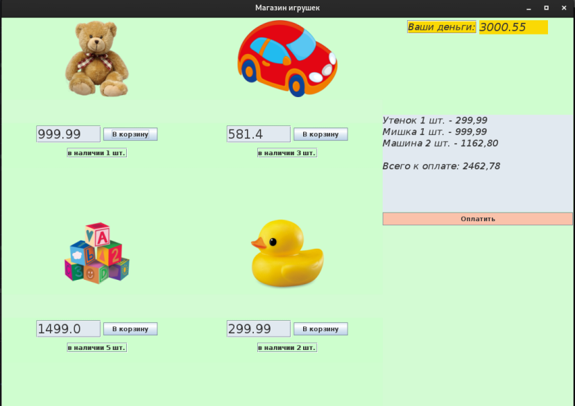

## Магазин игрушек

Опа, а все не так красочно как на картинке.   
Картинка не имеет ничего общего к решению задачи, содержание которой в переводе на человеческий язык 
можно представить в следующем виде:

* Написать проект, реализующий розыгрыш (лотерею) каких-либо предметов, например игрушек в магазине.
* У каждой игрушки может быть свой id, наименование и вес.
* Вес - это целочисленное значение, определяющее вероятность выпадания игрушки в ходе розыгрыша  

       Например  созданы 3 объекта:  

       id=1  name=конструктор  weight=2;  
       id=2  name=робот  weight=2;  
       id=3  name=кукла  weight=6; 

       Результат должен случайно вернуть любую игрушку в соответствии с весом.  
       в 20% случаях выходит конструктор  
       в 20% робот  
       и в 60% кукла.  
* Для сортировки объектов по весу использовать коллекцию java.util.PriorityQueue.
* Вызвать метод получения итогов розыгрыша 10 раз и записать результат в файл.
* Следует еще иметь в виду, что генерация случайных чисел предполагает, что некоторое число    
может выпасть и более 1 раза или вообще не выпасть и поэтому итоговые проценты могут    
не совпасть с ожидаемыми.
* Можно пренебречь созданием отдельных классов для каждой игрушки, наследуемых от общего
  абстрактного класса, т.к. это никак не влияет на решение задачи, а только лишь усложнит
  ввод данных.
